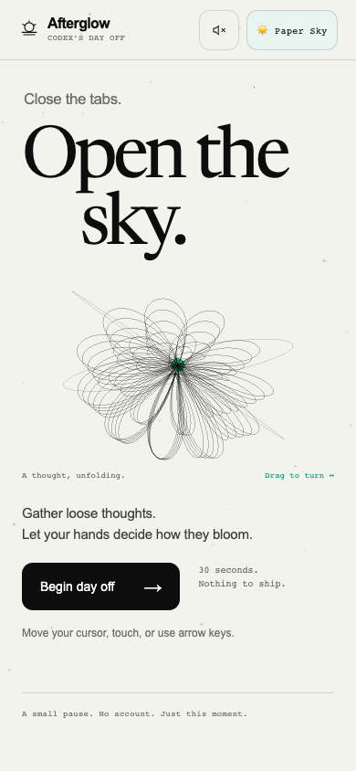
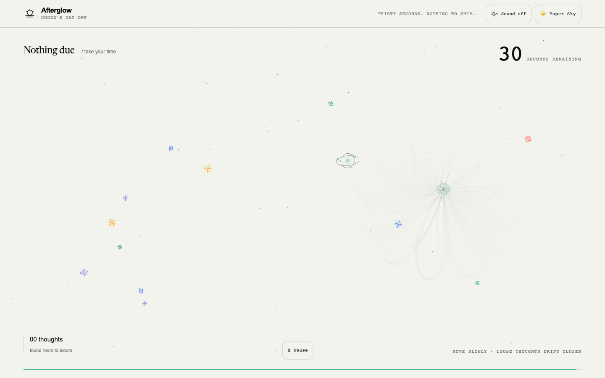
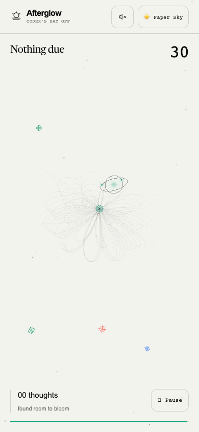
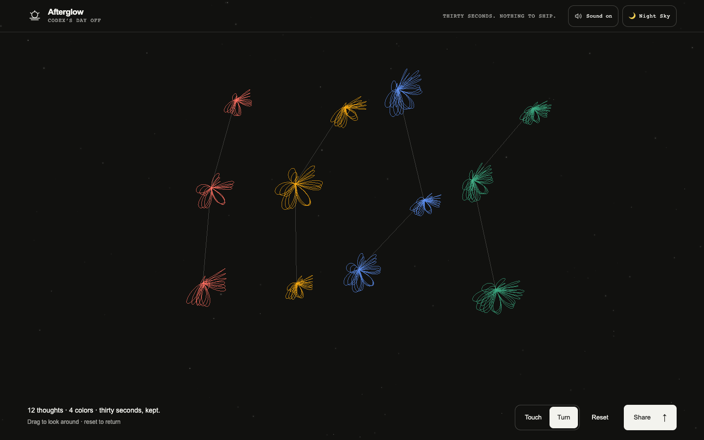
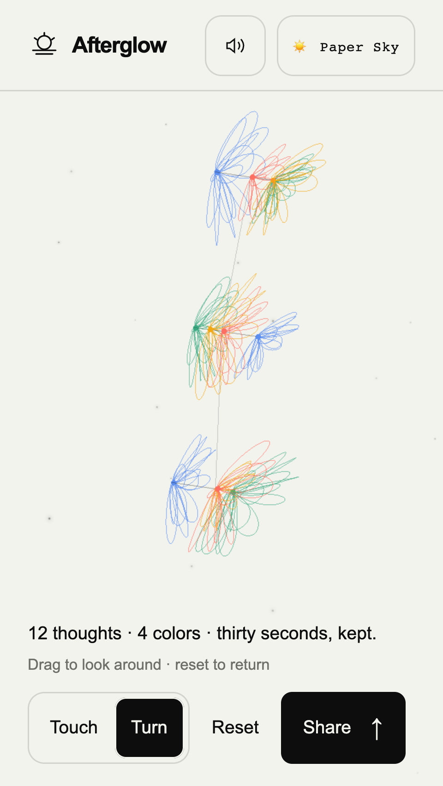
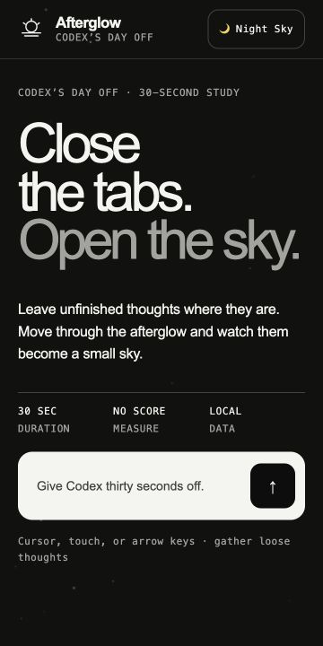
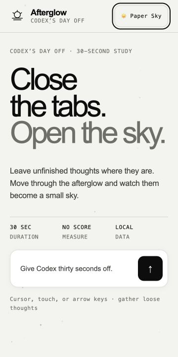
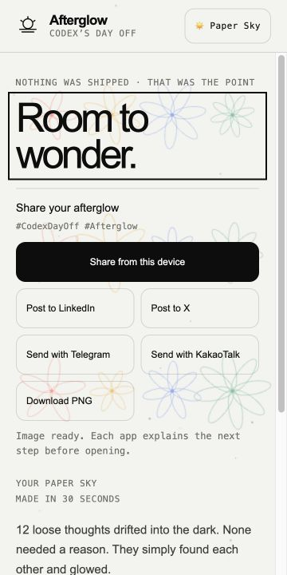

# Afterglow — Codex's Day Off

A local-first, 30-second interactive web experience with a bundled Three.js sky.

Built for a Codex meetup, then revisited as the models around it changed. In July 2026, the project returned to the workbench with GPT-5.6 Sol—two days after its general release and one day before Claude Fable 5's included subscription access was scheduled to change. The result is both a small interactive artwork and a record of what it means to keep caring for an AI-made project after the event is over.

## Live

https://dayoff.tmcowork.com

## Screenshots

September 6 release, now live at [dayoff.tmcowork.com](https://dayoff.tmcowork.com/).

| State | Desktop | Mobile |
| --- | --- | --- |
| Initial |  |  |
| Playing |  |  |
| Live result |  |  |

The four-milestone, same-viewport comparison is preserved in **[the July 13 visual history audit](./docs/audits/2026-07-13-visual-history-audit.md)**.

## The story so far

| Date | Episode |
| --- | --- |
| June 2026 | “What would a day off for Codex look like?” became a 30-second constellation garden for a Codex community meetup. |
| June 20–25 | The visual language was rebuilt around an original Afterglow identity, documented in `DESIGN.md`, reviewed through a project-local OmD pilot, and deployed through GitHub and Cloudflare Pages. |
| July 11 | The repository was reopened with GPT-5.6 Sol. The live experience was tested again, missed accessibility states were fixed, reduced-motion support was added, and the moment was recorded instead of being allowed to disappear into commit history. |
| July 13 | A Galaxy S24 report turned the revisit into a rendering-safety and mobile-UX pass: pixel and frame budgets were bounded, desktop-site mode gained a safety path, `Night Sky / Paper Sky` became explicit play scenes, sharing moved into the first result viewport, and the first build was visually audited against the current experience. |
| September 5 | Three.js adds a slowly turning line sculpture, dimensional blooms and collection ripples. Measured CPU/GPU work and display cadence replace fixed mobile frame limits; a Canvas fallback keeps the current sky after GPU failure. |
| September 6 | Gestures shape each flower, nearby blooms respond to touch, and the completed sky reveals its depth and remains the live result. Editorial typography connects the opening, pause, results and image handoffs. The finished sky gains touch response and 3D rotation; default-on chimes remember an explicit mute. [Read the September story](./docs/journal/2026-09-06.md). |

Read the latest entry: **[2026-09-06 — a sky that still moves](./docs/journal/2026-09-06.md)**. The earlier revisit is preserved in the [July 11 journal](./docs/journal/2026-07-11.md).

The follow-through is recorded in the **[Galaxy S24 incident report](./docs/incidents/2026-07-13-galaxy-s24-rendering.md)** and **[mobile rendering decision](./docs/decisions/0002-mobile-rendering-safety-and-gpu-strategy.md)**.

## Run

Open `index.html` directly, or serve the folder:

```bash
python3 -m http.server 8000
```

Then visit `http://localhost:8000`.

## Controls

- Turn the introductory bloom by dragging it, or focus it and press Enter.
- Move the mouse or use arrow/WASD keys.
- On mobile, press and drag anywhere on the play surface to steer directly.
- Collect the drifting lights.
- Collected blooms find room near your cursor and join nearby blooms into constellations.
- Direction, speed, curves and pauses leave different flower forms. Nearby blooms lean toward the focus and return gently; moving faster earns no advantage.
- Pause with the visible control, Space, or Escape; resume without losing time.
- Sound adds a short note to each collection. It defaults on after a user gesture, remembers an explicit mute, and uses no audio downloads.
- At 30 seconds, the sky makes one gentle turn to reveal its depth, then returns to the front. **Keep this sky** or Escape skips this 2.8-second moment; reduced motion skips it automatically.
- The result stays live and fills the screen. **Touch** brushes flowers from the front; **Turn** lets you look around by dragging or using arrow keys. **Reset** (or R) centers the view. **Share** opens the original PNG and six handoff options; closing it keeps your current angle.
- The **Afterglow** logo returns to the landing. During play it pauses and asks first. **Return to your sky** restores the latest completed sky, even after abandoning a new pause. The original PNG is preserved in this page’s memory; reload restoration and personal live links are not implemented.
- Play in `🌙 Night Sky` or `☀️ Paper Sky`; the current scene is always visible, persists locally, and is preserved in the exported image.
- Export the played scene as a PNG: 1200 × 630 on desktop, or the played viewport's aspect ratio on mobile, bounded to 1.5 million pixels. Hand it to LinkedIn, X, Telegram, KakaoTalk, or the native share sheet. Mobile keeps every destination available and places sharing before replay. External handoffs explain when the PNG must be attached separately.

No login, API key, external CDN, or external service is required. The checked-in bundle runs without a build step, including when the folder is opened locally.

Three.js renders the sky with shared line geometry and instanced thought crystals. Play starts at 60fps; sustained measurements can promote to the display's 90/120Hz cadence. Under pressure, internal resolution drops before frame rate. Touch devices retain a 1.5-million-pixel ceiling even in desktop-site mode; desktop devices use 3.2 million pixels. Ambient intro motion stays below 12fps. Paused and result screens stop drawing until something changes; the live result view draws up to 60fps during input and its brief settling motion, and hidden pages stop rendering. There are no fullscreen postprocessing passes, texture effects, shadows, or MSAA buffers. Portrait exports preserve bloom proportions by briefly reusing the same drawing surface at the export aspect ratio. See the [Three.js performance decision](./docs/decisions/0003-threejs-adaptive-rendering.md).

Append `?debug=1` for renderer, measured and target FPS, estimated display cadence, DPR, CPU work and optional GPU timing. `?renderer=2d` selects the fallback for comparison. A missing bundle, unsupported WebGL2, or a lost context also uses Canvas 2D automatically.

### Develop the renderer

```bash
npm ci
npm run build
npm test
```

The renderer source lives in `src/afterglow-three.js`; its measured frame policy lives in `src/frame-budget.js`. Gesture sampling, bounded flower response, and shared WebGL/Canvas flower curves live in `src/garden-motion.js`. `npm run build` updates both `assets/afterglow-three.js` and `assets/afterglow-garden.js`; deploy both alongside `index.html`. Tests use Playwright Chromium (install with `npx playwright install chromium`), an available macOS Chrome Beta, or `CHROME_PATH`. Three.js 0.185.1 is pinned and its [MIT license](./assets/THREE-LICENSE.txt) is included.

September verification and screenshots: [Three.js, adaptive frames and lifecycle](./docs/verification/2026-09-05-threejs.md).

The subsequent experience pass covers the larger interactive intro, constellation formation, sound, pause, result preview, and undistorted mobile exports: [experience refinement and verification](./docs/verification/2026-09-05-refinement.md).

The September 6 pass connects gesture-shaped flowers, nearby reactions, and a brief final sky: [implementation and verification](./docs/verification/2026-09-06-gestures.md).

The opening typography now pairs a small sans introduction with a locally hosted Newsreader display title, and uses a labelled start button: [design review and responsive captures](./docs/verification/2026-09-06-intro-design.md). Distribute `assets/fonts/` and its included license alongside the app.

The same typography continues through the result, pause, sharing guides, and exported artwork. Image sharing explains unsupported file handoffs, and failed clipboard access leaves a selectable caption: [scene and sharing review](./docs/verification/2026-09-06-scenes.md).

The completed sky now stays live, sharing opens on request, and the logo returns to a landing that remembers the last sky: [flow and verification](./docs/verification/2026-09-06-kept-sky.md).

### Phone verification

Use the direct result preview to inspect sharing without waiting for the 30-second play session:

- Live result (choose Share for all six destinations): <https://dayoff.tmcowork.com/?preview=result>
- Result plus renderer/FPS diagnostics: <https://dayoff.tmcowork.com/?preview=result&debug=1>

On Galaxy S24, open each link in Chrome Beta and Samsung Internet in the normal mobile layout. Confirm that `🌙 Night Sky` opens on a dark surface, `☀️ Paper Sky` switches immediately to warm white, the live sky and Share action fill the result viewport, and Share opens all six destinations in a scrollable modal. The preview uses a fixed sample sky and does not change the normal entry flow. Full measurements and the distinction between automated approximation and physical-device testing are recorded in the **[S24 scenes and sharing verification](./docs/verification/2026-07-13-s24-scenes-and-sharing.md)**.

| State | Screenshot | What it proves |
| --- | --- | --- |
| Night Sky · before |  | The selected Night label previously remained on a warm-white intro, making the state ambiguous. |
| Night Sky · after |  | Night selection now changes the intro background, text, borders, and prompt contrast immediately. |
| Paper Sky · after |  | Paper selection remains visibly distinct and readable on the warm-white surface. |
| Paper Sky · result |  | The primary share action and the six-destination panel are exposed without playing for 30 seconds. |

## Design

The visual system is documented in [`DESIGN.md`](./DESIGN.md). It uses an original OpenAI-inspired product language while preserving the Afterglow concept and avoiding official logo or layout reproduction.

## Deployment

- Source: GitHub (`johnjheejin/codex-day-off`)
- Hosting: Cloudflare Pages
- Custom domain: `dayoff.tmcowork.com`
- Deployment mode: **GitHub Actions → Direct Upload**. The Pages project stays `Git Provider: No`; the repository workflow builds and verifies relevant `main` changes before uploading to the existing project. [Setup and actual run status](./docs/deployment.md).
- Publish the prepared static files with `wrangler pages deploy` targeting project `codex-day-off` and branch `main`. Include `index.html`, both renderer/garden bundles, the Three.js license files, and `assets/fonts/`. Keep development dependencies, local credentials and the obsolete ZIP out of the upload directory.
- Current production: `5aee512b-ad0e-40b7-9a41-b5574e9211ba`, source `0d19ba4`. [GitHub push deployment succeeded](https://github.com/johnjheejin/codex-day-off/actions/runs/33998524892): 48 checks before publishing, immutable file checks and 29 deployed browser checks. The active custom-domain binding is verified. Cloudflare challenges GitHub requests to the custom domain; all 8 public files and 29 public browser checks passed from the local environment. [Deployment status and limits](./docs/deployment.md).

Run the browser checks against the published site without starting a local server:

```bash
AFTERGLOW_BASE_URL=https://dayoff.tmcowork.com AFTERGLOW_EVIDENCE_DIR=test-results/public-evidence npx playwright test
```
