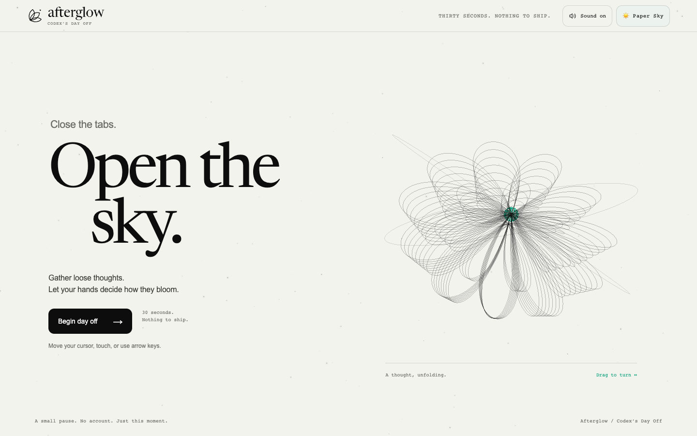
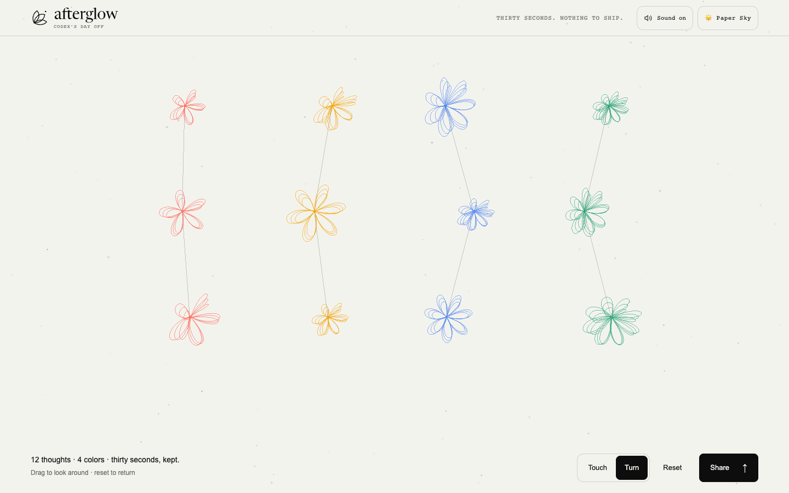
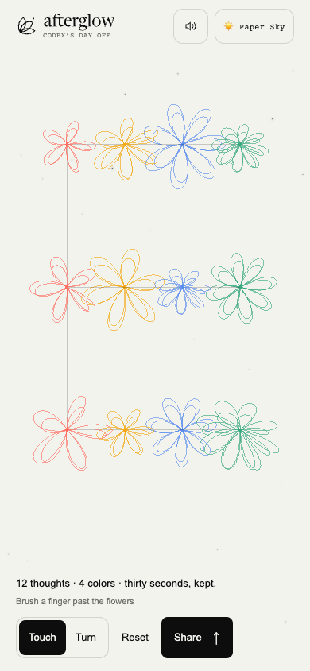

<picture>
  
</picture>

# Afterglow — Codex’s Day Off

A thirty-second pause that becomes a living sky. Gather loose thoughts with your hands, watch them unfold into flowers, then touch and turn the sky you made.

**[Open your sky ↗](https://dayoff.tmcowork.com/)** · [The latest story](./docs/journal/2026-09-06.md) · [Design and identity](./DESIGN.md)

No account, backend, API key, or remote font service. The experience runs in your browser. Originally made for a Codex community meetup; the September 2026 chapter was developed with GPT-6 Astra.

## The experience now

- **Your gestures leave a shape.** Direction, pace, curves and small pauses change each bloom. Nearby flowers lean toward your hand, then settle. Moving faster earns no advantage.
- **The ending opens a little depth.** After thirty seconds, your sky makes one gentle 2.8-second turn and returns to the front. The completed sky stays as the main view, with a small count and room to explore.
- **Touch, turn, stay.** Brush past the flowers or rotate the whole composition. A short touch still reaches its first response frame when drawing is delayed. Your original PNG stays unchanged as you look around.
- **Share when you want to.** Share opens the image, download and social options. Closing it returns to the same camera angle. Mobile PNGs preserve the played viewport’s proportions.
- **The landing is part of the pause.** The Afterglow logo returns to the beginning. During play it pauses and asks first. Return to your sky restores the latest completed sky, including after abandoning a new pause.
- **A new signature.** Three unfolding petals and one lingering point replace the old sun symbol. A lowercase serif wordmark connects the header, exported artwork, icons and repository cover.

The most recent completed sky is kept **in the current page’s memory**. Reload restoration, a permanent collection and personal live-share links are not implemented. Shared links open the public experience; the PNG carries your own sky.

## A look inside

Current desktop and mobile captures. The live-result examples use the built-in sample sky; the app preserves the composition you actually make.

| | Desktop · 1440 × 900 | Mobile · 390 × 844 |
| --- | --- | --- |
| Open the sky |  |  |
| Stay with it |  |  |

[Mobile sharing](./assets/verification/2026-09-06-identity/mobile-share.png) · [An actual exported PNG](./assets/verification/2026-09-06-identity/mobile-saved.png) · [Returning from the landing on a small phone](./assets/verification/2026-09-06-identity/small-return.png)

## Controls

| Where | What to do |
| --- | --- |
| Landing | Drag the line bloom, or focus it and press Enter. Begin day off starts the thirty seconds. |
| Playing | Move the mouse, use arrows/WASD, or press and drag on a phone. Collect drifting thoughts and let the flowers find room. |
| Pause | Use Pause, Space or Escape. Resume continues from the same time. |
| Sound | Short synthesized collection notes start enabled after your first gesture. An explicit mute is remembered. |
| Ending | Keep this sky or Escape skips the brief reveal. Reduced motion skips it automatically. |
| Living sky | Touch brushes flowers from the front. Turn rotates with a drag or arrow keys. Reset or R centers the view. |
| Sharing | Share opens six choices: native image sharing, PNG download, LinkedIn, X, Telegram and KakaoTalk. Escape closes the panel. |
| Going home | Click the Afterglow logo. Return to your sky reopens the latest completed work while this page remains open. |

Choose **🌙 Night Sky** or **☀️ Paper Sky** at any time. The selected scene is visible immediately, remembered locally, and included in the exported image. Desktop PNGs are 1200 × 630; mobile PNGs keep the played aspect ratio, with a 1.5-million-pixel ceiling and a 1920px long edge.

Social handoffs explain when you need to attach the PNG yourself. Unsupported image sharing offers download and caption steps. If clipboard access fails, the caption stays selectable. Nothing is posted automatically.

## Rendering with room to rest

Three.js uses shared line geometry and instanced thought crystals. Gesture forms and flower curves are shared with the Canvas fallback and PNG export. A GPU failure preserves the current sky instead of discarding the experience.

- Play starts at **60fps**. Measured display cadence and sustained CPU/GPU headroom can raise the target to 90 or 120fps.
- Under sustained load, internal resolution drops before frame rate. Touch hardware keeps a **1.5-million-pixel** limit even in desktop-site mode; desktop uses 3.2 million pixels.
- Ambient landing motion stays at or below 12fps. Live touch and the ending draw at up to 60fps. Settled results, paused play and hidden pages stop rendering until needed.
- There are no fullscreen postprocessing passes, shadows, texture effects or MSAA buffers. The logo is static, and its inline vector outlines require no extra font or image download.
- Reduced motion removes automatic sway and the ending rotation, while retaining deliberate view controls. Hidden and paused states suspend sound too.

These limits are tested automatically. **Physical Galaxy S24 temperature and power measurements remain outstanding**; browser emulation does not establish thermal safety. [Performance decisions](./docs/decisions/0003-threejs-adaptive-rendering.md) · [The original S24 incident](./docs/incidents/2026-07-13-galaxy-s24-rendering.md)

## Run locally

The checked-in app needs no build step. Open `index.html` directly, or serve the folder:

```bash
python3 -m http.server 8000
```

Visit [localhost:8000](http://localhost:8000/). For development:

```bash
npm ci
npx playwright install chromium
npm run build
npm test
```

Tests also use an available macOS Chrome Beta or an explicit `CHROME_PATH`. The suite covers **21 unit checks and 32 browser scenarios**, including a real thirty-second session, actual touch input, GPU loss, bundle failure, reduced motion, mobile sharing and result restoration. [Latest deployment evidence and limits](./docs/deployment.md)

Useful views:

| URL option | Purpose |
| --- | --- |
| `?preview=result` | Open a fixed sample live sky; choose Share to inspect the handoffs. |
| `?debug=1` | Show measured/target FPS, display cadence, DPR, CPU time and optional GPU timing. |
| `?renderer=2d` | Select Canvas fallback for comparison. |

## Source and identity

| File | Responsibility |
| --- | --- |
| [`index.html`](./index.html) | Experience flow, accessible controls, Canvas fallback, sound and PNG/social handoffs. |
| [`src/afterglow-three.js`](./src/afterglow-three.js) | Three.js scene, shared geometry and GPU lifecycle. |
| [`src/garden-motion.js`](./src/garden-motion.js) | Gesture sampling, flower forms and bounded touch response. |
| [`src/sky-view.js`](./src/sky-view.js) | Live-view transforms, ending reveal and input settling. |
| [`src/frame-budget.js`](./src/frame-budget.js) | Measured frame and pixel budgets. |
| [`assets/brand/`](./assets/brand/README.md) | Original symbol, outlined wordmark, icons and link-preview artwork. |
| [`DESIGN.md`](./DESIGN.md) | Visual language, identity, voice and interaction rules. |

`npm run build` regenerates the brand SVGs and inline identity, then bundles both runtime scripts. `npm run brand:images` exports the brand PNGs using Playwright. The app header and saved PNG read the same vector paths. The logo source adds no runtime dependency.

Three.js 0.185.1 is pinned and includes its [MIT license](./assets/THREE-LICENSE.txt). The locally hosted Newsreader face and its outlined wordmark retain the [SIL Open Font License](./assets/fonts/NEWSREADER-OFL.txt). Afterglow’s symbol is original; it is not the OpenAI or Codex logo.

## From GitHub to the public sky

Relevant `main` pushes run **GitHub Actions → build and checks → Cloudflare Pages Direct Upload → deployed checks**. The workflow verifies committed assets against their source, uploads an explicit public-file list, checks file hashes and the deployed browser experience, then verifies the active production/domain binding. Ordinary README, journal and screenshot changes do not redeploy the app.

The public address is **[dayoff.tmcowork.com](https://dayoff.tmcowork.com/)**. Authentication stays in GitHub secrets. No credentials, development dependencies or old ZIP are included in the published files. Current release IDs, environment-specific verification and recovery instructions live in the [deployment record](./docs/deployment.md).

To inspect the public site with the same browser suite:

```bash
AFTERGLOW_BASE_URL=https://dayoff.tmcowork.com \
AFTERGLOW_EVIDENCE_DIR=test-results/public-evidence npx playwright test
```

## The story continues

The June meetup question was simple: what would a day off for Codex look like? July brought accessibility work and a real mobile rendering incident. September added Three.js, gesture-shaped flowers, editorial typography, a live sky that survives a trip to the landing, and an identity drawn from the experience itself.

The project keeps that history without making every visitor read a changelog first.

- [September 6 — a sky that still moves](./docs/journal/2026-09-06.md)
- [July 11 — returning to the project](./docs/journal/2026-07-11.md)
- [July 13 — visual history of the first four versions](./docs/audits/2026-07-13-visual-history-audit.md)
- [Current work and remaining items](./docs/SESSION-HUB.md)
