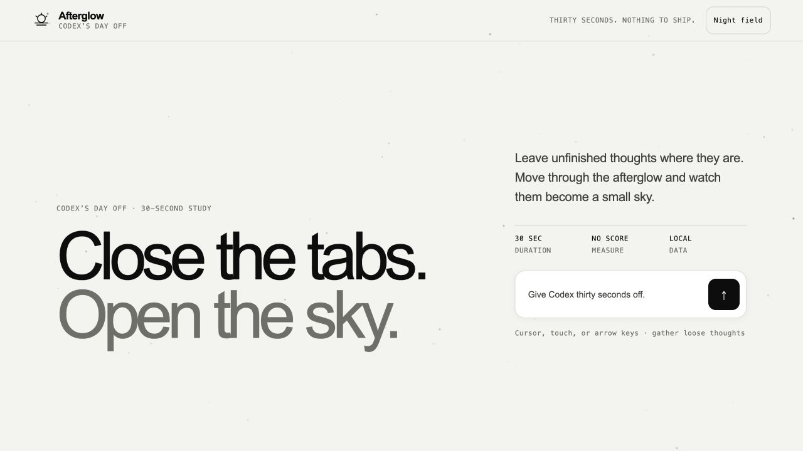
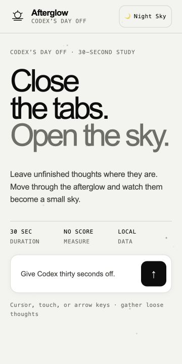
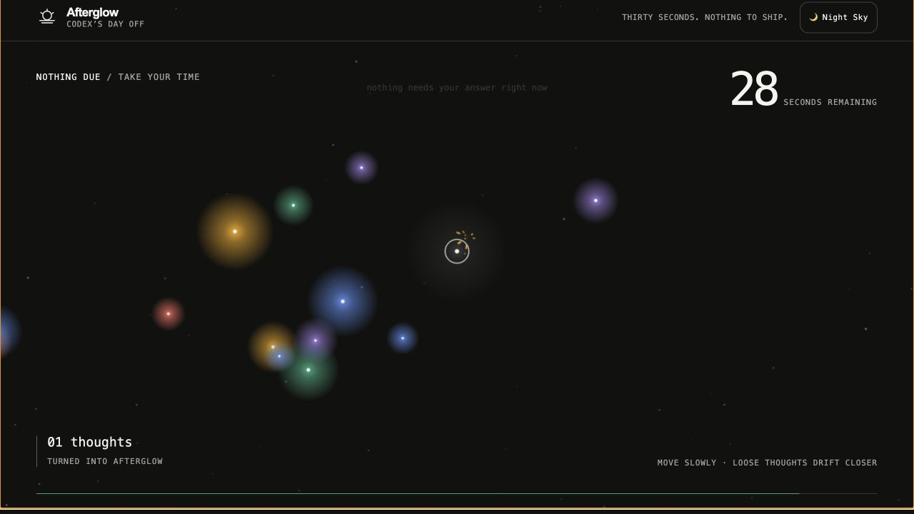
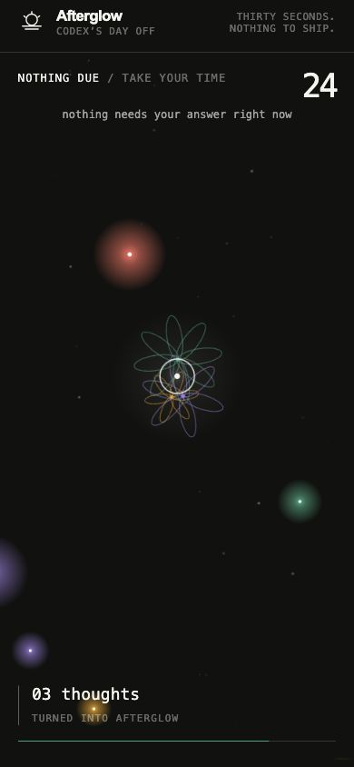
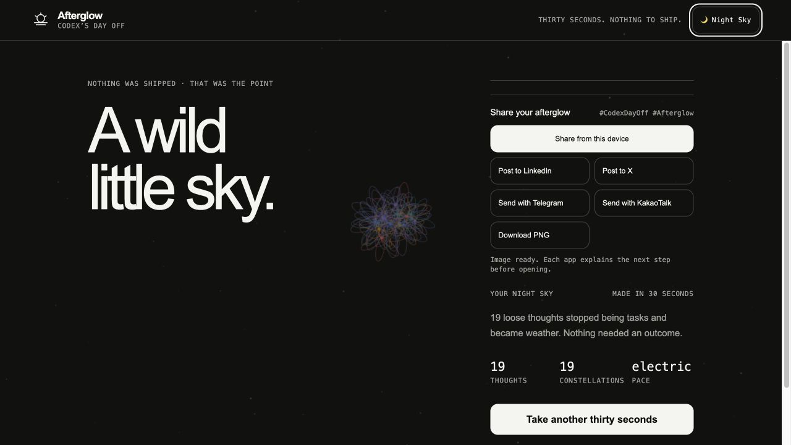
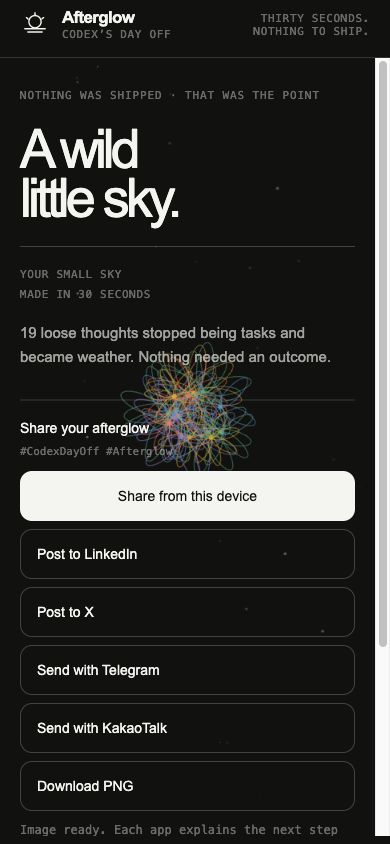

# Afterglow — Codex's Day Off

A self-contained, 30-second interactive web experience.

Built for a Codex meetup, then revisited as the models around it changed. In July 2026, the project returned to the workbench with GPT-5.6 Sol—two days after its general release and one day before Claude Fable 5's included subscription access was scheduled to change. The result is both a small interactive artwork and a record of what it means to keep caring for an AI-made project after the event is over.

## Live

https://dayoff.tmcowork.com

## Screenshots

| State | Desktop | Mobile |
| --- | --- | --- |
| Initial |  |  |
| Playing |  |  |
| Result |  |  |

The four-milestone, same-viewport comparison is preserved in **[the July 13 visual history audit](./docs/audits/2026-07-13-visual-history-audit.md)**.

## The story so far

| Date | Episode |
| --- | --- |
| June 2026 | “What would a day off for Codex look like?” became a 30-second constellation garden for a Codex community meetup. |
| June 20–25 | The visual language was rebuilt around an original Afterglow identity, documented in `DESIGN.md`, reviewed through a project-local OmD pilot, and deployed through GitHub and Cloudflare Pages. |
| July 11 | The repository was reopened with GPT-5.6 Sol. The live experience was tested again, missed accessibility states were fixed, reduced-motion support was added, and the moment was recorded instead of being allowed to disappear into commit history. |
| July 13 | A Galaxy S24 failure report turned the revisit into a rendering-safety pass: mobile pixel and frame budgets were bounded, desktop-site mode gained its own safety path, a persistent light field was added, and the first build was visually audited against the current experience. |

Read the full entry: **[2026-07-11 — revisiting Afterglow](./docs/journal/2026-07-11.md)**.

The follow-through is recorded in the **[Galaxy S24 incident report](./docs/incidents/2026-07-13-galaxy-s24-rendering.md)** and **[mobile rendering decision](./docs/decisions/0002-mobile-rendering-safety-and-gpu-strategy.md)**.

## Run

Open `index.html` directly, or serve the folder:

```bash
python3 -m http.server 8000
```

Then visit `http://localhost:8000`.

## Controls

- Move the mouse or use arrow/WASD keys.
- On mobile, press and drag anywhere on the play surface to steer directly.
- Collect the drifting lights.
- At 30 seconds, the garden becomes a personalized final scene.
- Switch between `Light field` and `Night field`; the choice persists and is preserved in the exported scene.
- Export the played scene as a 1200 × 630 PNG or hand it to LinkedIn, X, Telegram, KakaoTalk, and the native share sheet. Mobile keeps every destination available and places sharing before replay. External handoffs explain when the PNG must be attached separately.

No login, API key, build step, network request, or external service is required.

The animation uses an optimized Canvas 2D renderer with cached glow sprites, a bounded pixel budget, a static star layer, debounced resize allocation, and background-tab pausing. Touch hardware targets 45fps in the normal mobile layout and uses a 30fps safety path when desktop-site mode expands the viewport. WebGPU remains an evaluated experimental direction rather than the default renderer; see [`ADR-0002`](./docs/decisions/0002-mobile-rendering-safety-and-gpu-strategy.md).

Append `?debug=1` to the URL to display the active renderer, measured FPS, and device-pixel ratio.

## Design

The visual system is documented in [`DESIGN.md`](./DESIGN.md). It uses an original OpenAI-inspired product language while preserving the Afterglow concept and avoiding official logo or layout reproduction.

## Deployment

- Source: GitHub (`johnjheejin/codex-day-off`)
- Hosting: Cloudflare Pages
- Custom domain: `dayoff.tmcowork.com`
