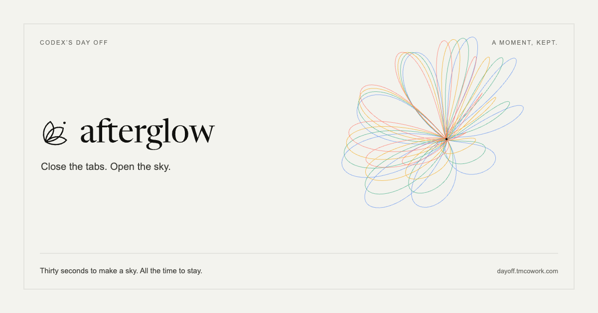

# Afterglow identity

Three petals unfold from one point; a detached dot carries the afterglow. The symbol comes from the line flowers and gestures in the experience. Its asymmetric fan replaces the former setting-sun icon. The lowercase wordmark uses hand-spaced Newsreader Display outlines.

## Assets

- [Symbol](./mark.svg) — monochrome, 36 × 36 viewBox.
- [Wordmark](./wordmark.svg) — portable outlines, no font request.
- [Full signature on light](./afterglow.svg) and [on night](./afterglow-night.svg).
- [Favicon](./favicon.svg) — symbol on paper, 48 × 48.
- [Home-screen icon](./apple-touch-icon.png) — 180 × 180 PNG.
- [Link preview and README cover](./social-card.png) — 1200 × 630 PNG; [vector source](./social-card.svg).

Keep the symbol and wordmark monochrome, with space around them. Use the inverse version on a dark surface. Do not animate the logo, fill each petal with a different color, or compress its proportions. Color belongs to the sky. The home button remains at least 44px high on phones.

## Rebuilding

[`identity.json`](./identity.json) holds the canonical symbol paths and wordmark outlines. `npm run build:brand` regenerates the standalone SVGs and the marked header block in `index.html`. `npm run brand:images` rasterizes the cover and home-screen icon through Playwright; install its Chromium or provide `CHROME_PATH`.

The saved PNG reads the header’s paths into `Path2D`, so it uses precisely the same logo without a separate image fetch. The cover’s bloom uses `flowerVertices` from the actual product geometry.

For an intentional change to the letters, `scripts/outline-wordmark.py` reads the existing local WOFF2 and applies the recorded pair spacing. It uses FontTools 4.61.1 with WOFF support as an optional artwork tool, not a project/runtime dependency. Run the normal brand build and PNG export afterward.

The symbol is original Afterglow artwork. The wordmark derives from Newsreader by Production Type and retains the [SIL Open Font License](../fonts/NEWSREADER-OFL.txt). This is an outlined wordmark, not a redistributed modified font. [Typeface source and attribution](../fonts/README.md).
