# 첫 빌드 목표 시각 검증 — 2026-07-13

이 문서는 최초 커밋부터 현재판까지 같은 뷰포트로 다시 렌더링해, 프로젝트가 처음 바라보던 방향이 실제 경험에 남아 있는지 확인한 기록이다. 7월 11일에 시작된 재방문 에피소드를 7월 13일 현재의 코드와 배포 상태로 판정했다.

## 검증 방법

- 최초판 `0b93ef0`, 편집 디자인 전환판 `462f8cc`, 공유 기능 완성 구간 `22b2276`, 현재 `30df2ea`를 각 커밋의 실제 `index.html`로 렌더링했다.
- 데스크톱은 1280×720, 모바일은 390×844로 고정했다.
- 현재판은 시작, 플레이, 30초 결과까지 실제로 진행했다.
- 화면 비교와 함께 `EVENT.md`, `SUBMISSION.md`, README, 전체 14개 커밋을 대조했다.
- 브라우저 자동화는 열과 GPU 드라이버 상태를 재현하지 못하므로 Galaxy S24 실기기 안전성은 별도 한계로 남긴다.

## 같은 화면, 네 시점

| 시점 | 데스크톱 | 모바일 | 확인된 변화 |
| --- | --- | --- | --- |
| 최초판 · `0b93ef0` | 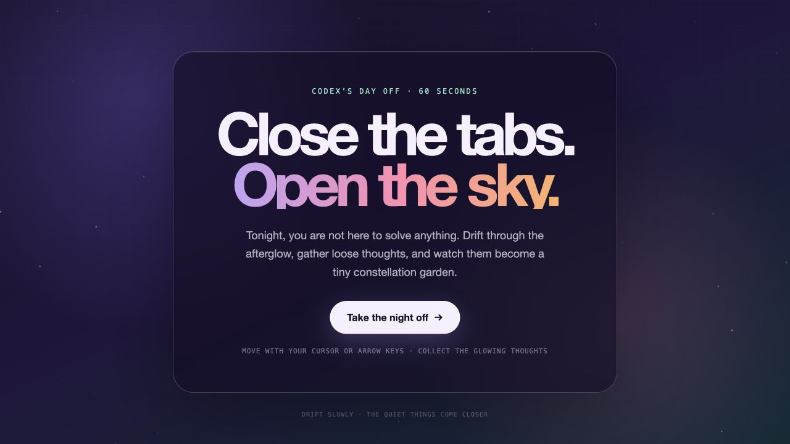 | 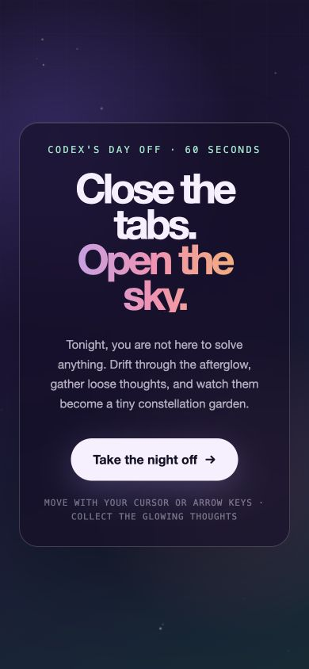 | 보라색 네온과 유리 카드가 감정은 강하게 전달했지만, 일반적인 이벤트 랜딩 페이지에 가까웠다. 60초, 마우스·키보드 중심이었다. |
| 편집 디자인 전환 · `462f8cc` | 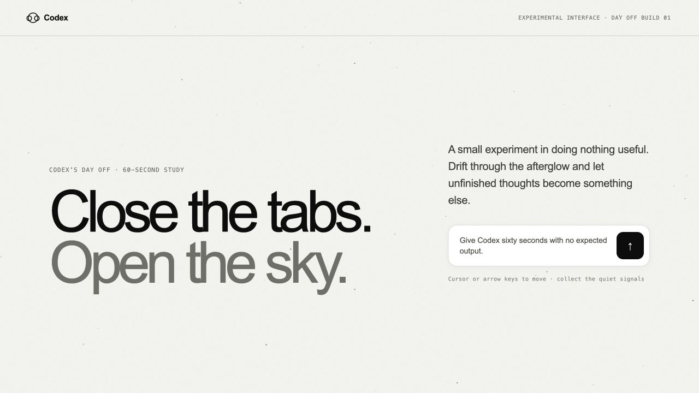 | 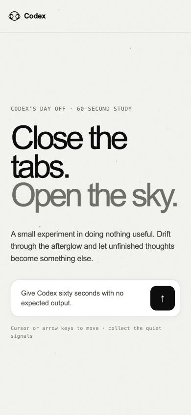 | 밝은 여백, 큰 활자, 얇은 규칙선으로 제품 편집물 같은 문법이 생겼다. 아직 Afterglow 고유 이름과 심볼은 정착 전이었다. |
| Afterglow 정착 · `22b2276` | 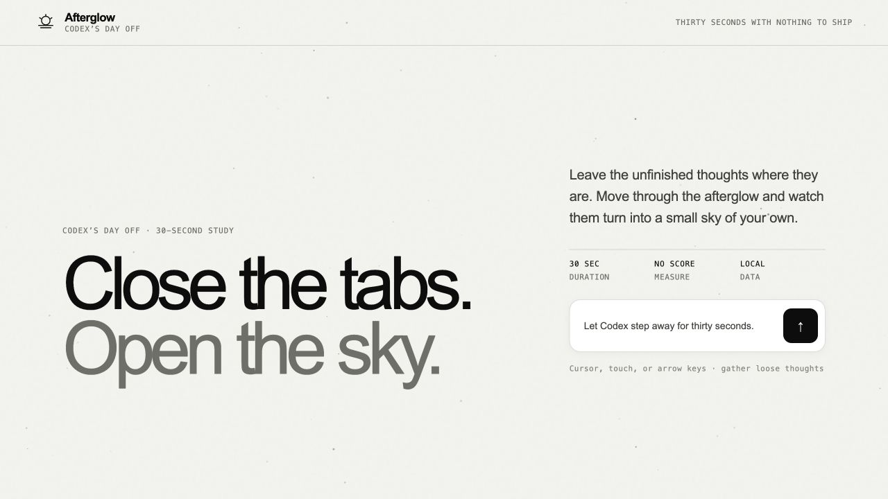 | 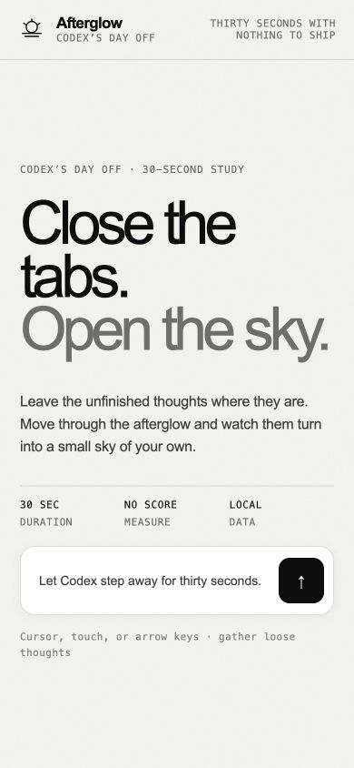 | 30초, 터치, 로컬 데이터, Afterglow 워드마크와 지평선 심볼이 한 체계로 묶였다. 현재 경험의 뼈대가 이 시점에 완성됐다. |
| 현재 · `30df2ea` | 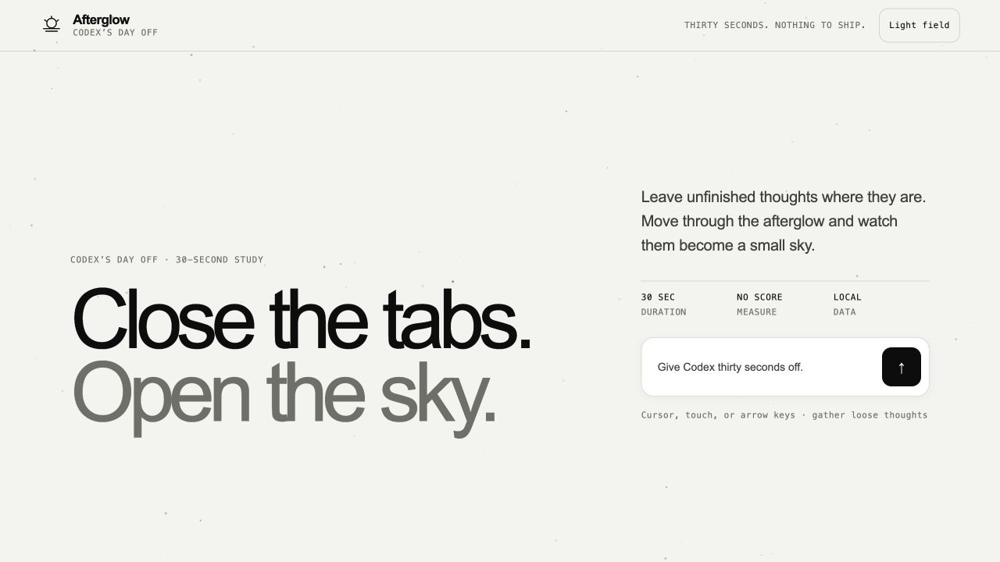 | 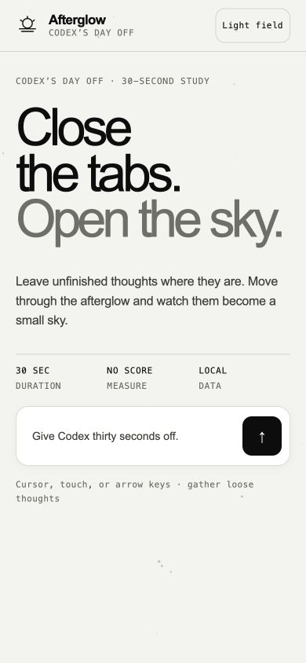 | 문장이 더 짧아졌고 `Light field`가 항상 보인다. 작은 화면에서도 가로 넘침 없이 핵심 행동과 세션 조건이 한 화면에 들어온다. |

## 현재 경험의 실제 흐름

| 플레이 | 결과 · Night field | 결과 · Light field |
| --- | --- | --- |
| 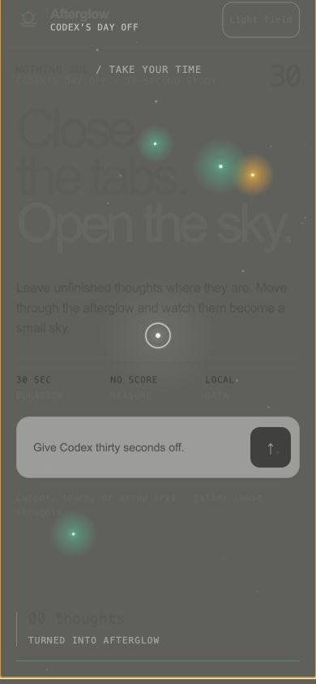 | 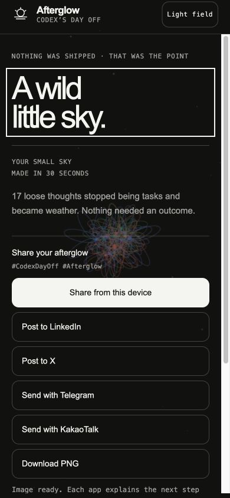 | 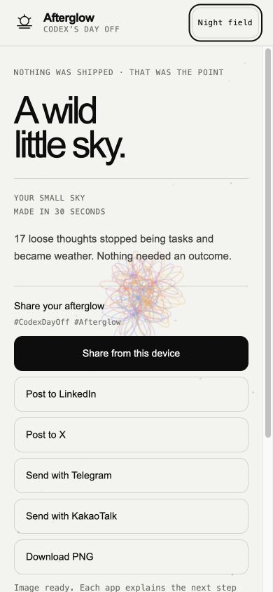 |

색을 잃은 것이 아니라 배치가 바뀌었다. 시작 화면은 조용한 기반으로 남고, 다섯 이벤트 색상과 빛은 상호작용과 결과에 집중된다. 밝은 필드는 어두운 팔레트가 기기에서 잘 보이지 않았던 사용자가 같은 그래픽을 다른 대비로 볼 수 있게 한다.

후속 Galaxy S24 피드백 뒤에는 이 설정형 이름을 `🌙 Night Sky / ☀️ Paper Sky`라는 두 플레이 장면으로 바꾸고, 모바일 결과의 공유 패널을 제목 바로 다음으로 옮겼다. 최신 S24 크기 증거는 [렌더링 사고 기록](../incidents/2026-07-13-galaxy-s24-rendering.md#같은-날-실기기-후속-피드백)에 이어진다.

## 최초 목표 판정

| 최초 또는 초기 기록의 목표 | 판정 | 현재 근거 |
| --- | --- | --- |
| Codex에게 기대 결과물이 없는 짧은 휴가를 준다 | 충족 | “Give Codex thirty seconds off”, 점수와 제출물이 없는 30초 흐름 |
| 커서와 키보드로 떠도는 생각을 모은다 | 충족 | 마우스, 화살표, WASD 입력과 수집 피드백 |
| 수집한 생각이 작은 별자리 정원이 된다 | 충족 | 플레이 궤적을 보존한 꽃과 연결선, 수량·속도별 결과 문장 |
| 설치·로그인·API 없이 즉시 열린다 | 충족 | 단일 HTML, 로컬 처리, 공개 Cloudflare Pages 배포 |
| 모바일에서도 같은 작품을 경험한다 | 충족, 실기기 재확인 필요 | 터치 조작, 390×844 무가로넘침, 모바일 공유 전체 노출; Galaxy S24 Chrome Beta와 Samsung Internet 열 검증은 자동화 범위 밖 |
| 결과를 가져가고 다른 사람에게 보여 준다 | 충족 | 1200×630 PNG, 네이티브 공유, LinkedIn·X·Telegram·KakaoTalk handoff |
| 오픈 디자인 원칙을 자기 언어로 만든다 | 충족 | 공식 자산을 복제하지 않은 Afterglow 이름·심볼·타입·색·상태 규칙과 `DESIGN.md` |

## 이번 검증에서 발견하고 보강한 부분

1. **대표 이미지 드리프트** — README의 여섯 장이 6월 25일판에 머물러 있었다. 현재의 테마 전환과 모바일 안전 패치를 반영한 시작·플레이·결과 이미지로 다시 기록했다.
2. **데스크톱 결과의 첫 인상** — 1280×720에서 두 결과 열을 아래에 맞추면, 오른쪽 공유 영역의 높이 때문에 왼쪽 핵심 제목이 첫 화면 아래로 밀렸다. 결과 열을 위에 맞춰 제목과 공유 영역이 함께 시작하도록 교정했다.
3. **성능 목표의 명문화** — Canvas 2D를 기본으로 유지하되 일반 터치 45fps, 터치 데스크톱 사이트 30fps, 대기·결과 12fps와 픽셀 예산을 코드·README·ADR에 같은 값으로 고정했다.
4. **GPGPU의 위치** — WebGPU는 현재 완성도의 누락이 아니다. 입자 500개 이상, 유체장·대규모 후처리 또는 예산 내 30fps 실패가 생길 때만 Canvas 2D fallback과 함께 실험한다.

## 아직 닫지 않은 항목

- Galaxy S24의 Chrome Beta 일반 모바일 모드에서 발열과 프레임 안정성 확인
- Samsung Internet 일반 모바일 모드에서 플레이, 테마 전환, 결과 공유 확인
- 루트의 구버전 `afterglow-static-html.zip`을 최신판으로 다시 만들지, 기록물로 제외할지 결정
- `SUBMISSION.md`의 행사 제출 체크리스트를 실제 제출 결과에 맞춰 확정

## 결론

첫 빌드의 핵심은 보존됐고, 표현은 더 고유해졌다. 최초판이 “밤을 쉬어 가자”는 감정을 먼저 만들었다면 현재판은 그 감정을 Afterglow라는 반복 가능한 시스템, 모바일 입력, 개인 결과, 공유 가능한 장면으로 바꿨다. 이번 점검에서 발견된 부족함은 새로운 대형 기능보다 증거의 최신화, 결과 화면의 위계, 그리고 실기기 안전성 확인에 있었다.
