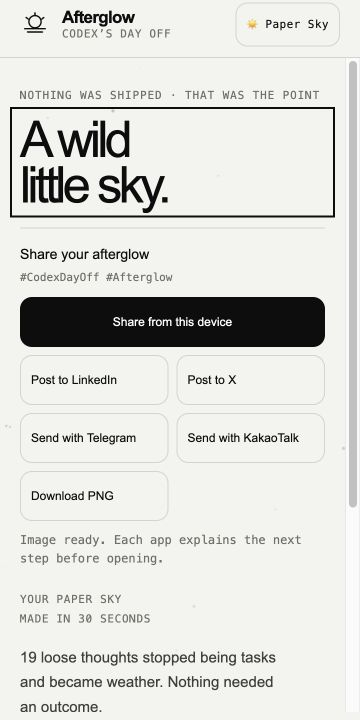
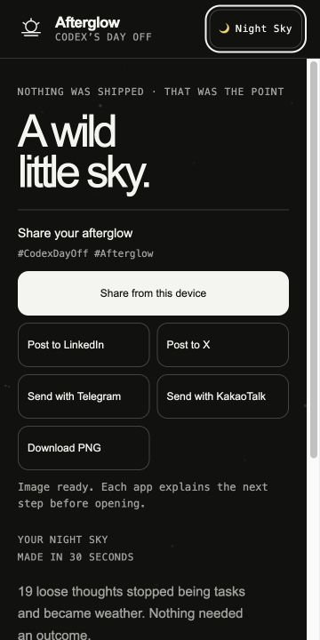

# 2026-07-13 Galaxy S24 렌더링 사고

## 영향

- 기기: Samsung Galaxy S24 기본 모델
- 브라우저: Chrome Beta
- 경로: `dayoff.tmcowork.com` 접속 후 데스크톱 사이트로 전환
- 증상: 브라우저를 넘어 전체 시스템 지연, 반복적인 Android System UI 재시작, 지속 발열, 기기 재부팅 필요
- 심각도: P0 — 실기기 안정성에 영향을 줄 수 있는 공개 배포 문제

## 사용자 관찰

어두운 플레이 화면에서 이벤트 팔레트가 기대만큼 명확하게 보이지 않았다. 밝은 화면 선택 버튼을 찾지 못해 데스크톱 사이트 전환을 시도했고, 그 직후 성능 문제가 발생했다.

## 코드에서 확인한 위험 경로

1. 모바일 판별이 `max-width: 760px`에만 의존했다.
2. Android 데스크톱 사이트가 넓은 가상 뷰포트를 만들면 휴대폰이 데스크톱 렌더링 프로필을 사용했다.
3. 모든 resize가 대형 캔버스 두 장과 관련 자원을 즉시 재생성했다.
4. 플레이는 터치 기기에서도 매 animation frame을 그렸다.
5. 전체 화면 SVG turbulence와 blend layer가 별도 GPU 합성을 요구했다.
6. 밝은 플레이 필드와 강제 다크 모드 방지 정책이 없었다.

## 대응

- 터치·coarse pointer 기반 모바일 성능 프로필
- DPR 픽셀 예산과 resize 디바운스
- 일반 모바일 45fps, 터치 데스크톱 사이트 30fps, 대기·결과 12fps
- 반복 스프라이트 생성 제거와 이전 배경 버퍼 선해제
- 전체 화면 procedural grain 및 blend 제거
- 페이지 이탈 시 대형 자원 해제
- `🌙 Night Sky / ☀️ Paper Sky` 두 플레이 장면 선택과 로컬 저장
- 선택한 필드를 1200×630 결과 PNG에도 반영
- `color-scheme: only light`로 브라우저의 임의 재착색 방지

## 원인 판단

기기 로그가 없으므로 단일 root cause는 확정하지 않는다. 가장 가능성 높은 시나리오는 데스크톱 사이트 전환 중 넓어진 뷰포트와 연속 resize가 대형 Canvas 2D/OffscreenCanvas 버퍼를 반복 할당하고, procedural filter 합성이 GPU·메모리 압박을 증폭한 것이다. Chrome Beta 또는 One UI 그래픽 스택의 결함이 함께 작용했을 가능성도 남아 있다.

## 재발 방지 원칙

- 휴대폰 성능 정책을 화면 너비로 해제하지 않는다.
- 그래픽 품질은 픽셀 예산과 장식 비용을 먼저 낮춰 보호한다.
- 실제 기기 장애를 사용자에게 다시 재현하도록 요구하지 않는다.
- 새 GPU 렌더러는 fallback, 컨텍스트 손실과 메모리 상한을 갖춘 실험으로만 도입한다.

## 해결 상태

- 해결 커밋: `d7c2d58` — `harden mobile rendering and add light field`
- GitHub `main` 반영: 2026-07-13
- Cloudflare Pages 배포: `cd6f228c.codex-day-off.pages.dev`
- 공개 도메인 확인: <https://dayoff.tmcowork.com> HTTP 200
- 라이브 HTML 확인: appearance control, 150만 픽셀 모바일 예산, 45/30fps 분기 포함; `feTurbulence` 제거
- 남은 운영 확인: Galaxy S24의 Chrome Beta와 Samsung Internet에서 일반 모바일 모드 1회 실행. 이전 데스크톱 사이트 장애 재현은 요구하지 않음.

## 같은 날 실기기 후속 피드백

Galaxy S24 일반 모바일 모드에서 성능 장애는 다시 보고되지 않았지만 두 UX 문제가 남아 있었다.

1. `Light field / Night field`가 화면 설정처럼 읽혀 현재 선택을 알아보기 어려웠다.
2. 30초가 끝난 뒤 공유 목적지가 사용자에게 보이지 않았다.

후속 교정에서는 화면 설정이라는 표현을 버리고 장면을 `🌙 Night Sky`와 `☀️ Paper Sky`로 이름 붙였다. 상단 컨트롤은 현재 장면을 이모지와 함께 표시하고, 접근성 라벨은 현재 장면과 전환될 장면을 모두 설명한다.

모바일 결과 DOM 순서는 `결과 제목 → 공유 → 장면 설명 → 통계·재시작`으로 바꿨다. 결과 스크롤 영역에는 `touch-action: pan-y`, iOS 계열 관성 스크롤과 명시적 `scrollTop = 0`을 적용했다. 360×720 재현에서 기본 공유 행동은 화면 상단 347px 안에 들어왔고 여섯 목적지가 모두 활성화됐다.

| Paper Sky | Night Sky |
| --- | --- |
|  |  |
