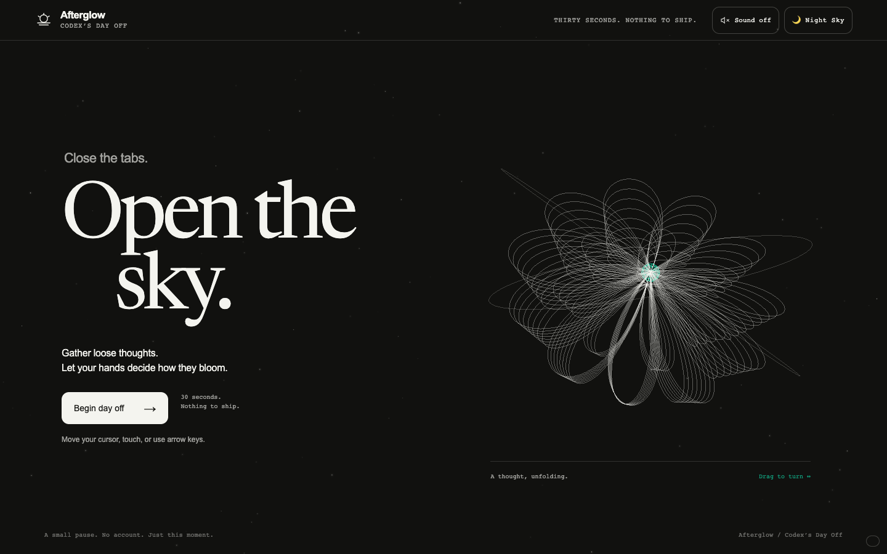
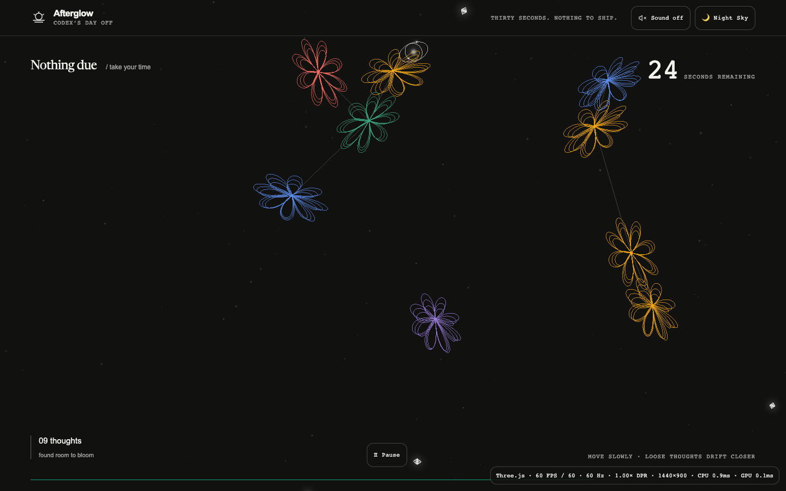
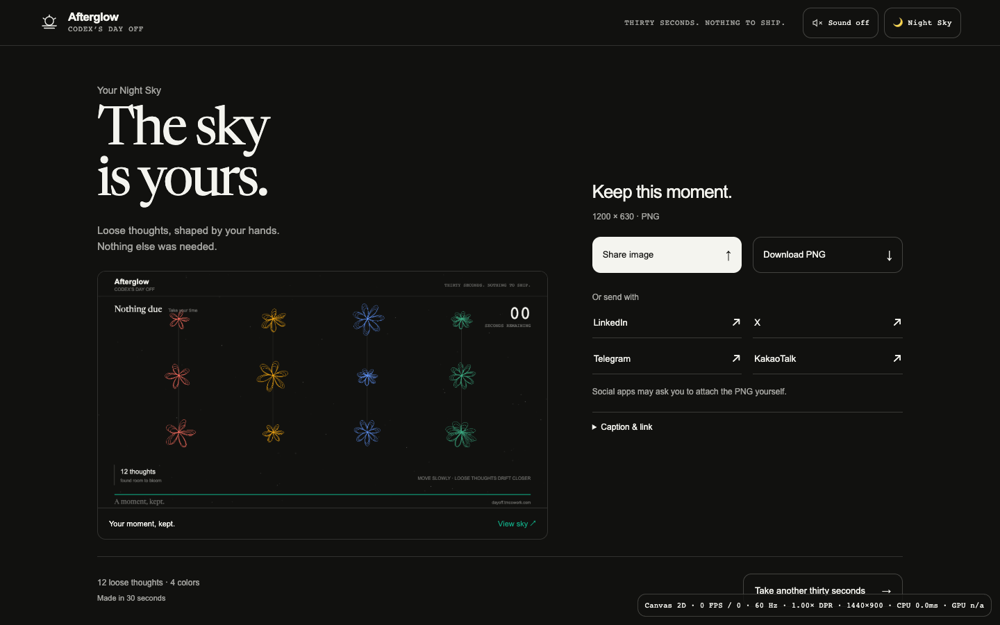
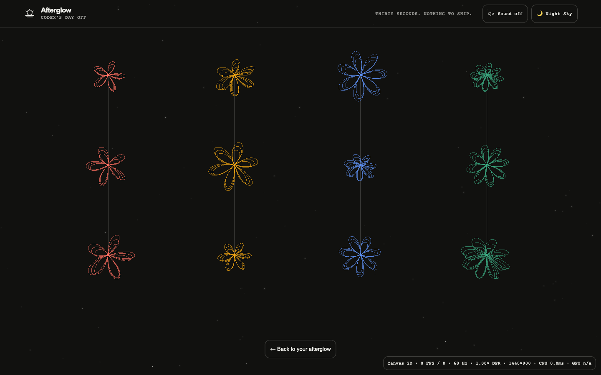
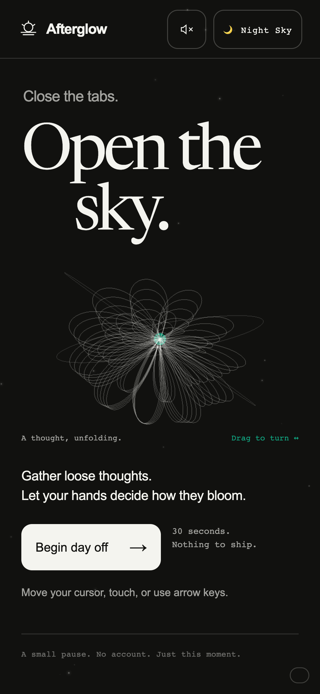

# Afterglow 경험 전반 개선

- 날짜: 2026-09-05
- 상태: 로컬 구현·검증 완료, 공개 배포 전

## 바뀐 경험

첫 화면은 큰 두 줄 제목, 짧은 설명과 시작 버튼, 직접 돌릴 수 있는 입체 꽃으로 구성된다. 꽃은 드래그와 키보드 Enter로 조작할 수 있다. 모바일에서는 제목, 꽃, 시작 행동 순서로 이어진다.

수집한 꽃은 가까운 빈 공간에 자리 잡고 이전 꽃과 선으로 연결된다. 파문과 색상 피드백을 유지하면서 같은 위치에 꽃이 쌓이는 현상을 줄였다. 선택형 소리는 기본값이 꺼져 있으며 사용자 동작 이후에만 오디오를 초기화한다. 로컬 sine oscillator로 짧은 수집음을 만들고 최대 6음만 동시에 허용한다.

Pause 버튼, Space와 Escape로 멈출 수 있다. 일시정지 중 타이머, 렌더링과 오디오를 멈추고 같은 위치에서 이어간다. 스크린리더에는 시작·완료 같은 의미 있는 사건을 알리며, 초 단위 카운트다운 전체를 반복해서 읽지 않는다.

결과에는 실제 PNG 미리보기와 전체 하늘 보기를 추가했다. 공유 뒤에 작품과 통계가 이어지는 모바일 순서를 유지한다. 중복되던 thought/constellation 수 대신 실제 사용한 색 수를 표시한다. 배경 꽃의 대비를 낮춰 본문과 공유 행동을 읽기 쉽게 했다.

## 렌더링과 PNG

- 변경이 없는 결과, 일시정지, reduced-motion intro는 반복 렌더링하지 않는다. 일반 intro는 12fps 이하, 직접 꽃을 돌리는 입력은 최대 60fps로 제한한다.
- 기존 주사율 측정, 해상도 우선 조절, 모바일 픽셀 상한과 Canvas 복귀를 유지한다.
- 별자리 선은 하나의 재사용 가능한 geometry로 그린다. 꽃 geometry와 export용 scene 객체도 원래 꽃 식별자를 공유해 material을 반복 생성하지 않는다.
- 모바일 PNG는 완료 시점의 플레이 화면 비율을 그대로 보존한다. 데스크톱은 1200×630이며, 모바일은 DPR 최대 2, 150만 픽셀과 긴 변 1920px 이내로 저장한다. 내보낼 때 동일한 GPU drawing surface를 잠깐 재사용하고, 꽃 크기는 동일 비율로 확대·축소한다. 같은 JavaScript 작업 안에서 원래 크기와 장면을 복원한다. 별도 WebGL context나 render target을 만들지 않는다.
- 꽃이 없는 하늘에 임의의 꽃을 추가하지 않는다. 장면과 수집 결과를 그대로 보존한다.

## 검증

`npm test`에서 프레임 정책 테스트 7개, 브라우저 시나리오 13개와 runtime guard를 통과했다. 최종 브라우저 실행은 57.4초였다.

실제 30초 플레이의 로컬 Chrome Beta 측정 지점은 60fps, CPU 작업 p90 약 0.8ms, 최근 GPU 샘플 약 0.2ms였다. 단일 로컬 측정이며 모든 기기에서의 성능이나 온도를 보장하지 않는다.

추가 검증은 꽃의 마우스·키보드 조작, 일시정지 중 시간과 렌더 횟수 고정, 재개와 포커스 복귀, 실제 PNG를 이용한 미리보기, 결과의 무반복 렌더링, 전체 하늘 보기와 Escape 복귀, 기본 무음·수집음 생성·오디오 해제, 모바일 PNG의 꽃 가로세로 비율을 포함한다.

320×568, 360×780, 390×844, 768×1024와 터치 데스크톱 모드 980×2123에서 버튼 접근·가로 넘침·공유 흐름을 확인했다. 기존 context loss, 번들 실패, resize 80회, background/page restore 검사도 통과했다. Galaxy S24 실제 기기의 열 안정성과 90/120Hz 물리 화면 측정은 여전히 별도 확인 대상이다.

## 포인터·모바일 이미지·Paper Sky 후속 교정

- 포인터의 두 링이 반대 방향으로 움직이며 각각 작은 빛이 궤도를 돈다. 입력 목표와 현재 위치의 차이로 기울기를 계산해 프레임 속도에 좌우되지 않도록 했다. 기존 point cloud의 점 1개를 3개로 늘렸으며 드로 콜과 geometry 수는 늘지 않는다. Canvas fallback에서도 같은 움직임을 제공하고 reduced motion에서는 궤도를 고정한다.
- Paper Sky의 loose thought glow를 먹색으로 바꾸던 것이 검은 덩어리의 원인이었다. 인스턴스별 옅은 색 결정과 작은 색 번짐으로 바꾸고, 포인터 빛은 청록색으로 조정했다.
- 모바일 결과와 공유 미리보기는 세로 이미지를 자르지 않는다. 완료 시점의 비율을 저장해 결과 화면 회전이나 장면 전환으로 가로 PNG가 되는 것을 막는다.
- 기존 정책 7개와 브라우저 13개 시나리오가 모두 통과했다(브라우저 57.8초). 추가로 번들이 없는 모바일에서 가로 회전·Paper Sky 전환 뒤 세로 PNG와 배경색 보존을 확인했다(1개 통과). runtime guard와 `git diff --check`도 통과했다.
- 별도 렌더 확인에서 포인터의 서로 다른 시각 두 프레임이 달라지는 것을 확인했고 페이지 오류는 없었다. 390×844 모바일 에뮬레이션의 실제 PNG는 780×1688이었다. 예시는 12개의 꽃이 있는 미리보기 장면이다.

[모바일 Paper Sky PNG](../../assets/verification/2026-09-05-refinement/mobile-paper-sky.png) · [Paper Sky 플레이 화면](../../assets/verification/2026-09-05-refinement/paper-playing.png)

## 화면

| 화면 | 캡처 |
| --- | --- |
| 첫 화면 |  |
| 별자리로 이어지는 플레이 |  |
| 실제 작품과 공유 |  |
| 전체 하늘 |  |
| 모바일 |  |
