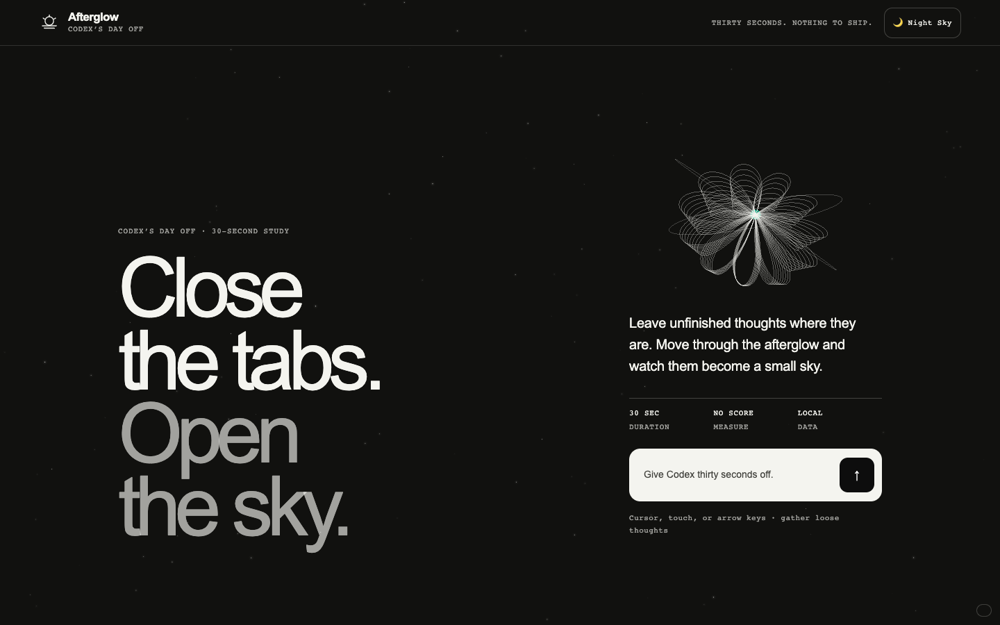
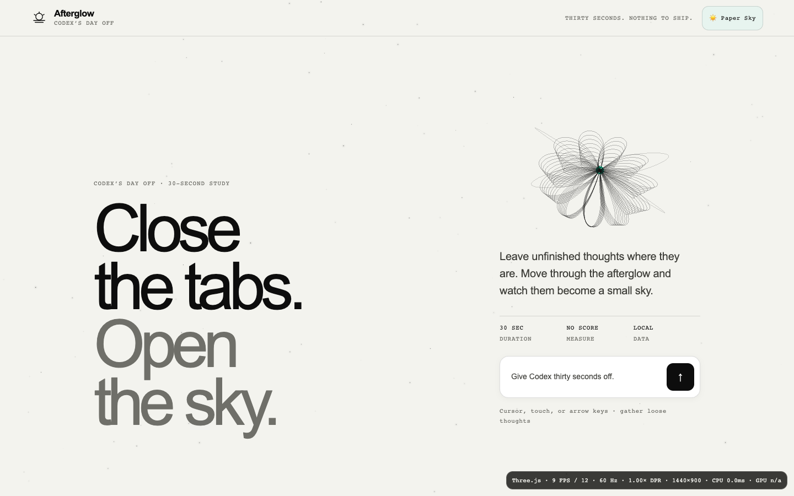
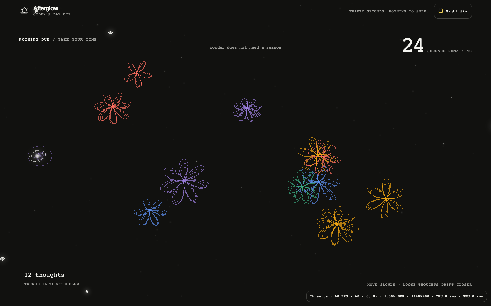
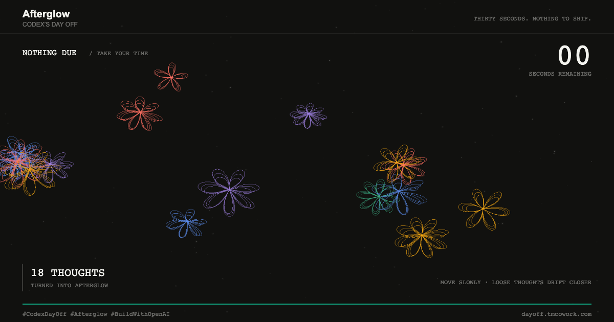
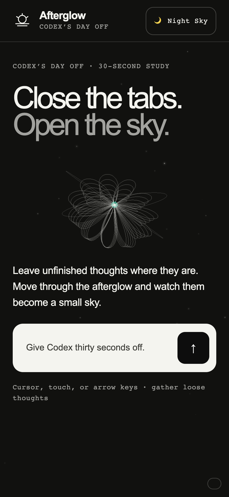
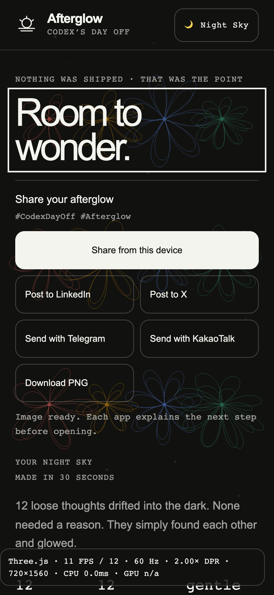

# Three.js와 프레임 조절 검증

- 날짜: 2026-09-05
- 환경: 로컬 macOS, 설치된 Google Chrome Beta, Playwright headless
- 공개 사이트: 이번 변경은 아직 배포하지 않음

## 측정 범위

1440×900, DPR 1의 로컬 브라우저에서 실제 30초 플레이를 실행했다. 시작 후 약 6.5초의 진단 값은 60fps / 목표 60fps, 추정 60Hz, CPU 작업 p90 약 0.7ms, 최근 GPU 샘플 약 0.2ms였다. CPU 값은 애플리케이션 update와 draw 제출 비용이며 브라우저 전체 프레임 시간이나 온도 측정이 아니다. 이 수치는 전체 세션의 최악값을 의미하지 않는다.

90Hz·120Hz 승격은 합성 타이밍을 주입한 정책 테스트로 검증했다. 실제 90/120Hz 화면에서 측정한 결과로 해석하면 안 된다. 모바일 테스트도 터치·DPR·뷰포트 에뮬레이션이며 Galaxy S24 실기기가 아니다.

## 자동 검증

`npm test`에서 정적 runtime guard, 프레임 정책 단위 테스트 7개, 브라우저 시나리오 8개가 모두 통과했다. 최종 브라우저 검증은 46.9초였다.

- 60Hz에서 불필요한 품질 저하 없이 60fps 유지
- 여유가 있는 90Hz·120Hz 타이밍에서 해당 주사율로 승격
- GPU 비용이 지속되면 해상도 먼저 감소, 그 후 프레임 감소
- 한 번의 부하 창은 품질을 바꾸지 않음, 회복은 점진적
- GPU 타이머가 없어도 CPU·RAF 측정으로 동작
- 8K까지 픽셀 예산 유지, 숨김 후 오래된 샘플 제거
- Night/Paper 장면 전환, Three.js 활성 시 입력 Canvas 1×1 확인
- 실제 30초 완주, 커서로 수집, 1200×630 PNG의 색상 픽셀과 크기 확인
- 공유 안내와 6개 목적지 유지, 재시작 시 꽃 객체 제거와 geometry 재사용 확인
- 360×780 터치 및 980×2123 터치 데스크톱 모드에서 픽셀 상한·터치 입력·공유 접근 확인
- WebGL context loss 이후 12개 thought 결과를 Canvas 2D로 보존
- 번들 요청 실패 시 진입·플레이 가능
- reduced motion에서 시작 꽃 이미지가 정지함
- 동일 크기의 resize 이벤트 80회에서 버퍼 재할당 0회
- 숨김 중 렌더 횟수가 증가하지 않음, pagehide에서 자원 해제, pageshow에서 단일 GPU 캔버스로 복구

재시작 시 꽃의 material은 해제되고, 4가지 꽃잎 geometry는 다음 플레이에 재사용된다. 비어 있는 point cloud는 그리지 않는다.

## 픽셀 예산

| 환경 | DPR 상한 적용 후 | 실제 drawing buffer 픽셀 | 상한 |
| --- | --- | --- | --- |
| 터치 360×780, device DPR 3 | 2.00 | 1,123,200 | 1,500,000 |
| 터치 데스크톱 모드 980×2123, device DPR 3 | 약 0.85 | 1,499,264 | 1,500,000 |
| 데스크톱 1280×720, device DPR 2 | 1.50 | 2,073,600 | 3,200,000 |
| 8K 7680×4320, device DPR 2 | 약 0.31 | 3,198,285 | 3,200,000 |

## 시각 증거

| 화면 | 캡처 |
| --- | --- |
| Night intro |  |
| Paper intro |  |
| 실제 플레이 |  |
| 플레이 결과 PNG |  |
| 모바일 intro |  |
| 모바일 공유 |  |

## 남은 확인

Galaxy S24의 Chrome Beta·Samsung Internet에서 정상 모바일 모드의 짧은 플레이와 발열 상태를 직접 측정하지 못했다. 과거 System UI 장애의 단일 원인도 GPU·OS 로그가 없어 확정할 수 없다. 코드와 에뮬레이션 검증을 실기기 열 안정성 보증으로 대신하지 않는다.
